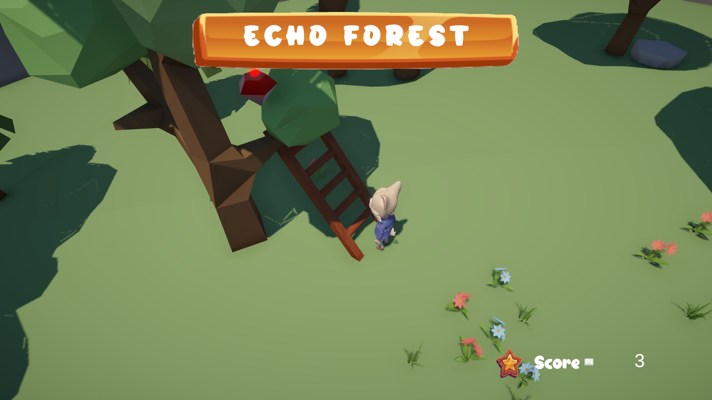

# Echo Forest

Développement d'un jeu personnel pour un test de compétences.  
Réalisation autonome.  
Environ 2 jours de travail.

## Description

Echo Forest est un petit jeu développé en solo, visant à démontrer mes compétences en développement gameplay sur Unity.

## Technologies utilisées

- Unity
- C#
- Git

## Captures d’écran

## Contrôles

- ZQSD  : déplacements
- E     : intéragir avec les objets
- A     : utiliser l'item
- I     : inventaire

## Auteur

Benjamin Benon  
[LinkedIn](https://www.linkedin.com/in/benjamin-benon-78b495194/)
